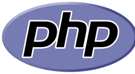

  
  <h1>PHP Lab Repository</h1>
  
<strong>Learning PHP step-by-step with practical lab exercises</strong>

---

## 📘 About This Repository
This repository contains all the PHP concepts and examples we practiced in our lab sessions with our instructor.  
It’s designed to help understand the **core fundamentals of PHP** through simple, hands-on examples.

---

## 🧠 Topics Covered
Below are the main PHP concepts we’ve explored so far:

- 🐘 **Introduction to PHP**
  - Syntax, Variables, Data Types, and Output
- 🧮 **Operators**
  - Arithmetic, Comparison, Logical, Assignment, and String operators
- 🔁 **Control Structures**
  - if, else, switch, loops (for, while, do-while, foreach)
- 🧱 **Functions**
  - Defining, calling, and using parameters/return values
- 🗂️ **Arrays**
  - Indexed, Associative, and Multidimensional arrays
- 📝 **Forms & User Input**
  - Using `$_GET` and `$_POST`, form validation
- 💾 **File Handling**
  - Reading and writing files in PHP
- 🧩 **Include & Require**
  - Reusing code efficiently
- 🧍‍♂️ **Sessions & Cookies**
  - Managing user sessions and persistent data
- 🗄️ **Database Connection (MySQL)**
  - Connecting, querying, and displaying data

---

## 🧰 Folder Structure

php_lab/
├── lab1/
    ├── printing word in php(hello.php)
    ├── comment in php
    ├── forrm in php(taking user input)
    ├── forms/
├── lab2/
    └── variables
    └── conditionals(control_structures)
    ├── switch
    └── functions
    └── fizzbuzz(simple challenge)
    └── calculator(medium project with js for ajax)
